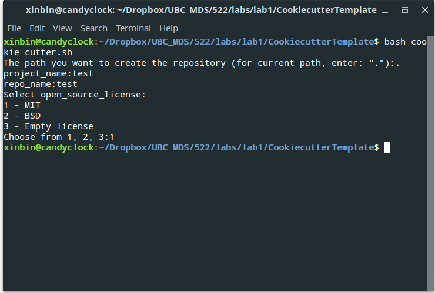

# CookiecutterTemplate- Data Analysis
__Author__: Xinbin Huang

__Date__:  November 17, 2017

## Overview
A simple and logical file/directory structure for doing and sharing data analysis project.

## Requirements to use the cookiecutter template:

- Bash shell 

## Installation & Execution
First, clone the repository to local disk. Open the bash terminal, and type:

For __HTTPS__
```
git clone https://github.com/xinbinhuang/CookiecutterTemplate.git
```
or

For __SSH__
```
git clone git@github.com:xinbinhuang/CookiecutterTemplate.git
```

Open the terminal and run: (Or first copy/paste the `cookie_cutter.sh` to the location you want to create a project repository)

```
bash cookie_cutter.sh
```


## The resulting directory structure
The directory structure of the generated new project looks like this:

```
.
├── CITATION.md       
├── README.md              
├── LICENSE.md             -- license information 
├── doc                    -- text documents associated with the project 
├── models                 -- scripts to train models 
├── data                   -- raw data and metadata used for the project
├── results                -- all generated analysis, rendered documents and visualizations  
└── src                    -- all source code files for this project(.R, .py, .Rmd, .ipynb)
```
